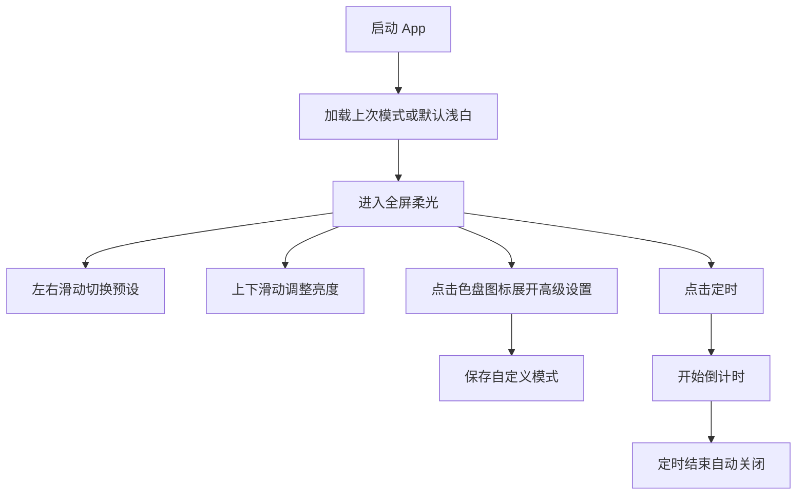

# 产品需求文档（PRD）

生成时间: 2026-03-17 12:05:26

## 1. 背景与目标
- 背景:
  - 屏幕灯光类竞品普遍偏工具型，核心能力集中在白屏、亮度、广告。
  - 缺少真正强调柔光质感和场景表达的产品。
- 业务目标:
  - 将 `Soft Light` 定位为高质感屏幕柔光灯，而不是普通白屏工具。
  - 建立 `柔光模式 + 手势交互 + 本地化` 的产品认知。
- 用户目标:
  - 快速得到柔和不刺眼的补光
  - 在极少操作下切换到合适模式
  - 保存并复用自己的灯光偏好

## 2. 用户与场景
- 目标用户画像:
  - 夜间轻照明用户
  - 自拍/拍照补光用户
  - 睡前陪伴和婴儿起夜用户
  - 桌面氛围和专注用户
- 核心场景:
  - 起夜时需要柔和米白灯
  - 自拍时需要浅白/粉白补光
  - 睡前需要暖黄低亮模式
  - 阅读或桌面场景需要稳定纯色光源

## 3. 功能需求
### 3.1 核心功能
- `F1 预设模式`
  - 系统提供 12 个柔光预设模式
  - 前置推荐顺序: 浅白、米白、粉色、暖黄色
  - 用户左右滑动灯光区域切换模式
- `F2 灯光显示`
  - 灯光区域默认接近全屏
  - 输出纯色，不使用渐变
  - 保持无边缘灰影
- `F3 亮度调节`
  - 用户在灯光区域上下滑动调节亮度
  - 亮度变化实时生效
- `F4 手动色盘`
  - 控制条中只展示图标入口
  - 点击图标展开色盘设置
  - 用户可保存自定义颜色到本地
- `F5 定时关闭`
  - 支持常用定时档位
  - 定时结束自动熄灯
- `F6 语言自动适配`
  - 自动读取设备语言
  - 支持 Top 10 语言
  - 读取失败默认英文

### 3.2 支撑功能
- `S1 上次状态恢复`
  - 记录上次使用模式、亮度、是否开启
- `S2 沉浸式显示`
  - 尽量隐藏系统干扰
- `S3 图标与品牌素材`
  - 使用原创四灯珠品牌体系
- `S4 广告控制`
  - 免费版低频广告
  - 不允许广告压住主灯光区域

## 4. 用户流程与交互

- 状态定义:
  - 默认态: 显示当前柔光模式
  - 亮度变化态: 拖动中实时反馈
  - 色盘展开态: 底部展开高级颜色选择
  - 定时态: 显示剩余时间
- 异常处理:
  - 读取设备语言失败: 默认英文
  - 本地配置读取失败: 回退到默认浅白模式
  - 应用从后台恢复: 保持最近一次状态

## 5. 规则与策略
- 模式规则:
  - 每个预设模式由 `名称 + 颜色值 + 默认亮度建议` 组成
  - 自定义模式最多保存 `N` 个，超过后提示覆盖
- 亮度规则:
  - 上滑增亮，下滑减亮
  - 最小值保持可见，避免完全黑屏误判
- 广告规则:
  - 不在主灯光显示区显示横幅
  - 不在首次打开 10 秒内弹插屏
- Pro 规则:
  - 解锁更多高级模式
  - 解锁无限自定义
  - 去广告

## 6. 数据与埋点
- 关键指标:
  - `app_open`
  - `light_on`
  - `mode_swipe`
  - `brightness_change`
  - `custom_color_open`
  - `custom_color_save`
  - `timer_start`
  - `timer_finish`
  - `ad_impression`
  - `pro_paywall_view`
- 事件定义:
  - `mode_swipe`
    - 入参: `from_mode`, `to_mode`
  - `brightness_change`
    - 入参: `mode_name`, `brightness_value`
  - `custom_color_save`
    - 入参: `hex_color`, `slot_index`

## 7. 非功能需求
- 性能:
  - 首屏进入时间 < 1s
  - 滑动切换和亮度调节无明显卡顿
- 安全:
  - 不采集不必要权限
  - 本地配置仅存储在设备端
- 合规:
  - 图标与素材必须原创
  - 商店文案不夸大护眼治疗等医疗表述

## 8. 版本范围
- In Scope:
  - 12 预设模式
  - 色盘自定义与保存
  - 左右滑动切换模式
  - 上下滑动调亮度
  - 定时关闭
  - 多语言自动适配
- Out of Scope:
  - 账号体系
  - 云同步
  - 社区分享
  - 桌面小组件

## 9. 发布与验收
- 里程碑:
  - `M1` 完成视觉和交互稳定版
  - `M2` 完成多语言和本地存储
  - `M3` 完成商业化最小验证
- 验收标准:
  - 默认模式正确显示
  - 左右滑动能切换模式
  - 上下滑动能调节亮度
  - 色盘可保存并复用
  - 设备语言切换正确
  - 正式包可正常安装并运行
