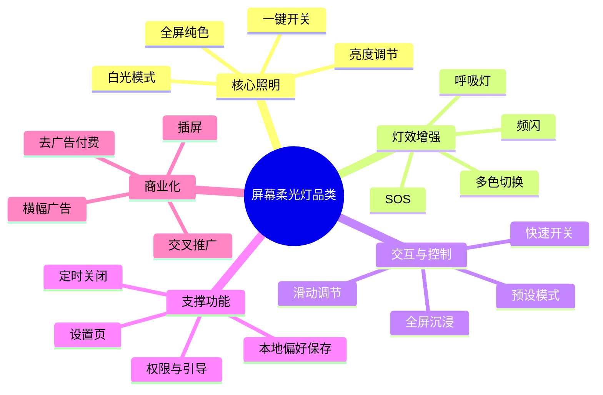
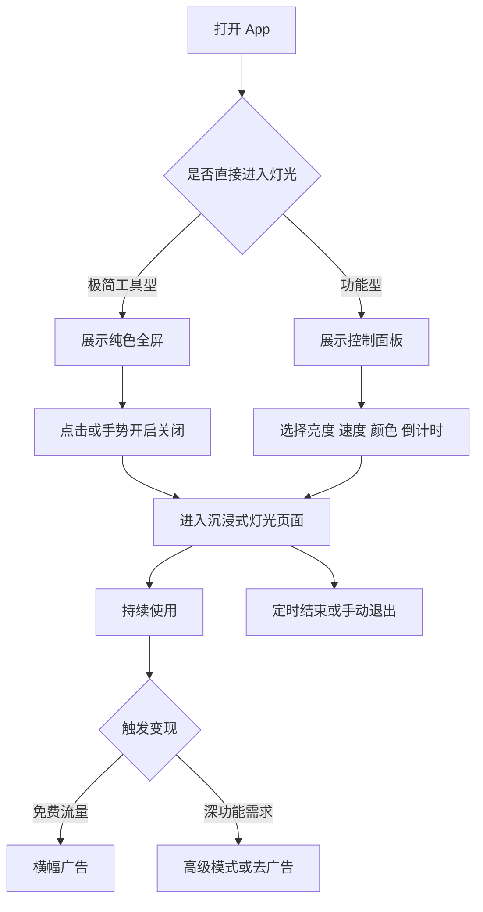

# 竞品分析方案

生成时间: 2026-03-17 12:05:26

## 1. 研究范围与样本
- 研究目标: 为 `Soft Light` 找到最贴近的屏幕柔光/白屏照明竞品，识别核心能力、变现方式与差异化切入点。
- 样本数量: 4
- 样本清单:
  - `cz.nowi.whitescreen` | White Screen Flashlight | Tools | v1.12
  - `com.bbtoolsfactory.whitescreen` | White Screen, White Screen Lig | Productivity | v1.0.13
  - `com.shyri.whitescreenapp` | Bright White Screen Flashlight | Tools | v1.8
  - `com.jkfantasy.screen.jkpscreenlight` | Screen Light & Breathing Light | Entertainment | v1.3.2
- 目标用户:
  - 夜间起夜、应急照明、停电场景用户
  - 阅读补光、拍照补光、桌面氛围灯需求用户
  - 睡眠陪伴、婴儿夜灯、轻度放松场景用户
- 主要场景:
  - 一键打开全屏照明
  - 手动调亮/调暗
  - 纯白屏、暖光、柔和彩光
  - 短时定时或节律变化

## 2. 产品功能框架脑图

## 3. 产品流程图

## 4. 截图证据映射
| 样本 | 证据 | 结论 |
| --- | --- | --- |
| `cz.nowi.whitescreen` | `cz.nowi.whitescreen/screenshots/shot_001.png` + `ui_001.xml` | 首屏含 `speed_selector`、`brgthness_selector`、`OnOffButton`，属于功能型白屏灯 |
| `cz.nowi.whitescreen` | `cz.nowi.whitescreen/screenshots/shot_002.png` + `ui_002.xml` | 点亮后顶部和底部都出现广告位，广告变现较重 |
| `com.bbtoolsfactory.whitescreen` | `com.bbtoolsfactory.whitescreen/screenshots/shot_001.png` + `ui_001.xml` | 首屏只有纯屏内容和底部 `adView`，定位极简纯白屏工具 |
| `com.shyri.whitescreenapp` | `com.shyri.whitescreenapp/screenshots/shot_001.png` + `ui_001.xml` | 首次进入有系统全屏提示，说明依赖沉浸式体验 |
| `com.shyri.whitescreenapp` | `com.shyri.whitescreenapp/screenshots/shot_002.png` + `ui_002.xml` | 主界面仅中心 `power` 控件，典型一键型工具 |
| `com.jkfantasy.screen.jkpscreenlight` | `ui_001.xml` + `ui_002.xml` | 运行时被拉到 `com.android.vending` 登录页，真机或商店依赖影响了首屏直达 |
| `com.jkfantasy.screen.jkpscreenlight` | APK 静态字符串与资源 | 存在 `FxProcessor`、`ScreenBrightProcessor`、`CountdownProcessor`、`SettingProcessor`、`AdProcessor`，功能明显更丰富 |

## 5. 核心功能拆解
### `cz.nowi.whitescreen`
- 核心功能: 白屏照明、亮度调节、速度调节、一键开关、频闪/SOS
- 体验亮点: 进入即看到控制器，学习成本低
- 体验问题: 控件占屏幕比例高，广告位明显

### `com.bbtoolsfactory.whitescreen`
- 核心功能: 空白纯屏显示
- 体验亮点: 极简即开即用
- 体验问题: 差异化弱，底部广告破坏纯屏

### `com.shyri.whitescreenapp`
- 核心功能: 中心电源按钮、全屏沉浸
- 体验亮点: 信息量低，聚焦开关
- 体验问题: 首次全屏提示增加打断，没有高级能力入口

### `com.jkfantasy.screen.jkpscreenlight`
- 核心功能: 自定义柔光、亮度处理、呼吸灯/灯效、倒计时、设置、手势控制
- 体验亮点: 能力深度明显高于白屏工具型竞品
- 体验问题: 运行链路不稳定，首屏复杂度可能更高

## 6. 变现策略对比
| 样本 | 广告证据 | 变现判断 | IAP 判断 |
| --- | --- | --- | --- |
| `cz.nowi.whitescreen` | `play-services-ads*.properties` + `ui_002.xml` 顶/底 `adView` | 横幅广告主导 | 未发现计费证据 |
| `com.bbtoolsfactory.whitescreen` | `play-services-ads*.properties` + `admob_empty_layout.xml` + `ui_001.xml` 底部 `adView` | 横幅广告主导 | 未发现计费证据 |
| `com.shyri.whitescreenapp` | `play-services-ads*.properties` + `admob_empty_layout.xml` | 具备广告集成，可能延后触发 | 未发现计费证据 |
| `com.jkfantasy.screen.jkpscreenlight` | `play-services-ads*.properties` + `AdProcessor` + `PromoteActivity` | 广告 + 交叉推广概率高 | 未发现计费证据 |

结论:
- 赛道主流打法是 `免费 + 广告`，不是订阅优先。
- 竞品普遍没有把“高级灯效”和“低打扰变现”平衡好。

## 7. 产品差异化对比
| 维度 | `cz.nowi` | `bbtoolsfactory` | `shyri` | `jkfantasy` | 对 `Soft Light` 的启示 |
| --- | --- | --- | --- | --- | --- |
| 定位 | 功能型白屏灯 | 极简纯白屏 | 一键全屏灯 | 柔光/呼吸灯 | 更适合做柔光体验型而非白屏工具型 |
| 控制方式 | 开关 + 亮度 + 速度 | 几乎无控制 | 中心开关 | 多模块/手势/设置 | 手势 + 单行模式切换是更优折中 |
| 视觉风格 | 工具感 | 极简 | 极简 | 偏功能集合 | 可用高质感视觉做明显区隔 |
| 变现 | 双横幅偏重 | 底部广告 | 广告集成 | 广告 + 推广 | 先控制广告密度，再做收费 |

## 8. 结论与机会
- 品类核心能力:
  - 秒开
  - 全屏稳定输出
  - 可控亮度/模式
  - 沉浸式低学习成本
- 当前品类缺口:
  - 缺柔光质感，而非只有纯白工具
  - 缺拍照/肤色/氛围场景导向预设
  - 缺低打扰商业化设计
  - 缺品牌感与视觉品质
- 对 `Soft Light` 的建议切入:
  - 做 `柔光模式预设 + 手势调节 + 手动色盘` 的体验型产品
  - 模式命名和情绪场景绑定，如 `Soft White`、`Blush Pink`、`Warm Amber`、`Moon Blue`
  - 保持极简首屏，但允许高级面板抽屉式展开
  - 商业化优先级放后，先做差异化口碑
- 风险点:
  - 纯工具赛道被系统能力和大量同质化 App 挤压
  - 全屏纯色功能门槛低，容易被复制
  - 广告过重会直接伤害夜灯/睡眠场景

## 9. 研究备注
- APKPure 直链被 Cloudflare 和证书链拦截，本轮切到 APKCombo 动态下载链路完成样本获取。
- `com.jkfantasy.screen.jkpscreenlight` 安装成功，但模拟器首屏被拉到 Google Play 登录页，因此本轮只拿到静态与异常运行证据。
